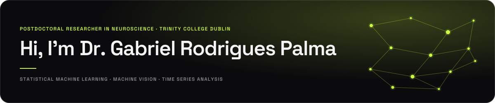
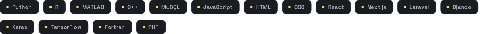

<!--
  Artwork in /assets is generated from the gabrielrpalma.com design tokens:
  Space Grotesk (display) + Inter (body), lime #cdfb43 on near-black in dark mode,
  olive #556d00 on off-white in light. Two files per design, theme-swapped.
-->

<picture>
  <source media="(prefers-color-scheme: dark)" srcset="assets/hero-dark.svg">
  <source media="(prefers-color-scheme: light)" srcset="assets/hero-light.svg">
  
</picture>

- 🔬 I'm currently a Postdoctoral Researcher in Neuroscience at <a href="https://www.tcd.ie/">Trinity College Dublin</a>
- 🎓 I hold a PhD in Data Science from <a href="https://maynoothuniversity.ie/">Maynooth University</a>, funded by the <a href="https://www.data-science.ie/">SFI Centre for Research Training in Foundations of Data Science</a>
- 🔭 My research focuses on Statistical Machine Learning, Machine Vision and Time Series Analysis
- 🧠 I'm currently working on understanding learning from EEG data using Machine Learning and Hidden Markov Models
- 🌱 I'm experienced in Computer Vision, Deep Learning, Time Series and Deep Generative modelling methods
- 🌐 Check out my website: <a href="https://www.gabrielrpalma.com/">gabrielrpalma.com</a>

 

<picture>
  <source media="(prefers-color-scheme: dark)" srcset="assets/sec-stack-dark.svg">
  <source media="(prefers-color-scheme: light)" srcset="assets/sec-stack-light.svg">
  
</picture>

<picture>
  <source media="(prefers-color-scheme: dark)" srcset="assets/stack-dark.svg">
  <source media="(prefers-color-scheme: light)" srcset="assets/stack-light.svg">
  
</picture>

<picture>
  <source media="(prefers-color-scheme: dark)" srcset="https://ghchart.rshah.org/cdfb43/GabrielRPalma">
  <source media="(prefers-color-scheme: light)" srcset="https://ghchart.rshah.org/556d00/GabrielRPalma">
  
</picture>

 

<picture>
  <source media="(prefers-color-scheme: dark)" srcset="assets/sec-connect-dark.svg">
  <source media="(prefers-color-scheme: light)" srcset="assets/sec-connect-light.svg">
  
</picture>

 

